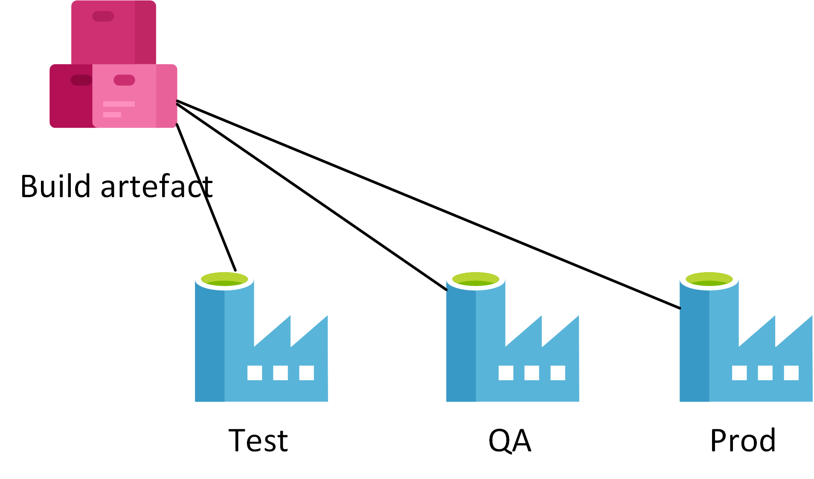

# Data Platform DevOps - Azure Data Factory
**Produced by Dave Lusty**

# Introduction
This demo shows how to use DevOps pipelines and branching for code promotion within Azure DevOps.

## Azure Data Factory and DevOps

Azure Data Factory works differently than many other products in terms of how to promote code. It also works very differently when integrating with Git repositories than it does when not working in this way. This is because much of the functionality is built into the product. This includes the code editing environment, branching functionality and build functionality to "compile" the solution and build an artefact. As such, when using this product we just need to collect that artefact for use in the DevOps pipeline. Ensure you read the guide thoroughly to understand how you need to use this product for the most effective DevOps pipelines.

An overview of the process is shown below:

## Backlog and work items

This guide will assume that you already know how to create a backlog and work items within Azure DevOps or some other tooling in order to link them to your branches and builds. This is an essential part of the DevOps landscape which should not be overlooked. Simply automating deployment is not DevOps and offers very few of the advantages of the technique. When done alone, automated deployment will often add complexity rather than remove it.

## Environments

As a minimum, you will need to have one development environment, and one deployment environment. 

### Development environment

Development will be carried out within a development environment. Here you will work on feature branches and eventually merge them into a collaboration branch for testing and deployment. This environment will be used to publish and build the code, creating an ARM template which will become your build artifact. A single environment can be used for multiple feature branches, with code saved to the repository in the branch while being worked on.

### Deployment environments

Generally multiple deployment environments will be used in order to stage deployment. There are two ways to achieve this, either a deployment environment per build, or a deployment environment per stage. The choice here is one of how the deployment environments will fit into your wider DevOps strategy and how you may deploy other components. There is no "best way" in terms of deployment environments, you simply need to ensure that your code has been tested before arriving in production.

In this set up deployment artifacts are deployed in turn to three static environments. A gate is used within Azure DevOps to hold deployments until the next environment is ready to be deployed to.

In this set up, a new Data Factory instance is deployed each time a new build is created. Instead of using different environments for different stages, the same environment is used for testing (perhaps with parameters for storage etc.) and triggers modified, enabled and disabled as the environment moves to production. This has the advantage of encapsulation of a build and feature set.

## Branching

### Feature Branches

While you can create branches within Azure Data Factory, it is probably easier to create them within Azure DevOps since you can link work items from the backlog to them in order to track the work and changes which were added. Within the development environment you can then open any branch being worked on. You may also choose to create your branches within the product and later link them to work items within Azure DevOps and both will work equally well.

### Collaboration Branches

The collaboration branch is the main branch as far as the development environment is concerned. This is where the feature branches will be merged via a pull request, and also where the deployment and build will take place.

### ADF_Publish

ADF_Publish is a special branch where the build artifacts are placed after a publish action is completed. These artifacts will consist of ARM templates which can be used to deploy changes into an existing or a new Data Factory environment.

## Publish

When working in a DevOps enabled Data Factory, you can only publish from within the development environment. Other environments will be deployed using ARM templates through the DevOps pipeline. When you deploy into the Development environment from your collaboration branch, Data Factory will deploy changes to that environment and also create the ARM artifacts in the ADF_Publish branch of the repository.

## Pipelines

### Build

Your build pipeline will be either started manually, or triggered when changes are made to the ADF_Publish branch of your code repository. This pipeline will then copy the files from this branch and create an artifact in the build system from them. Although you could use them directly from the repository, this is not the normal way to use DevOps pipelines, and would prevent merging with other changes such as Spark scripts or SQL Data Warehouse changes which need to be deployed together. As such, we recommend using the DevOps product to create a build artifact.

### Release

You will also create one or more release pipelines. For Data Factory, these will be ARM deployments which push the code into your deployment environments. The release pipelines will generally be triggered from a successful build, and will be given the artifact to use in deployment. While these may contain other code such as Spark scripts, we will not discuss orchestrating multiple changes in this demo since it is very specific to your environment and needs. 

# Setting up the environment

For this demo, you will need one Azure DevOps project and two Data Factory environments. While we will use the built in repo functionality in this demo, GitHub can also be used in exactly the same way. Azure Data Factory currently only supports Azure DevOps Repositories and GitHub repositories, so no other repository will work at the time this guide was written.

## Azure DevOps Project

Log into your Azure DevOps 