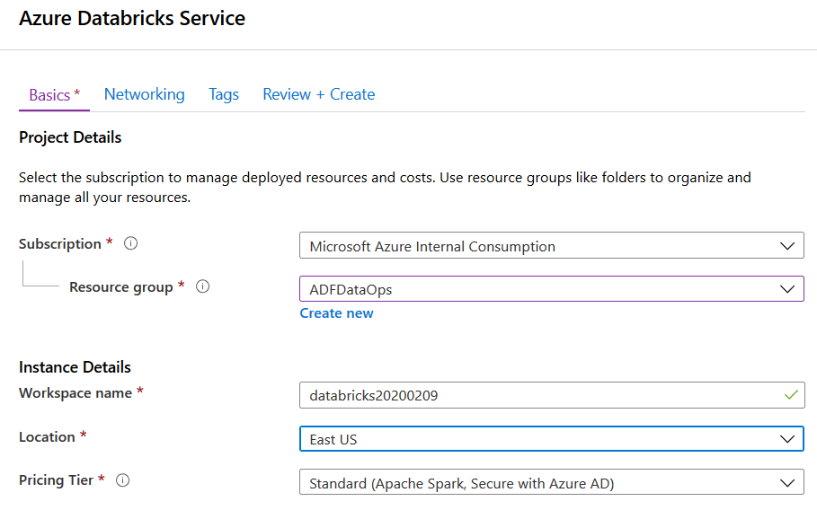
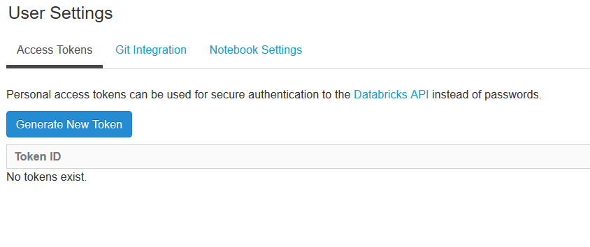
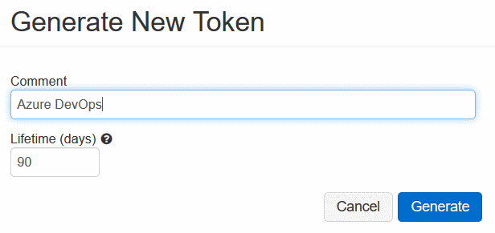
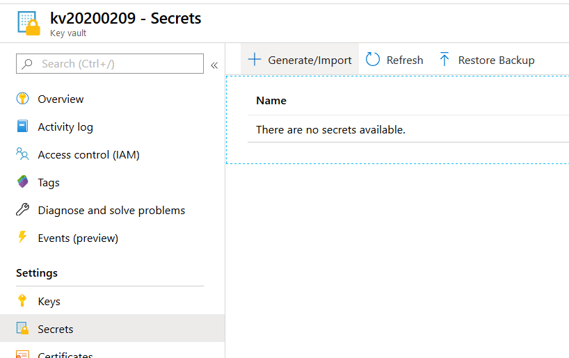
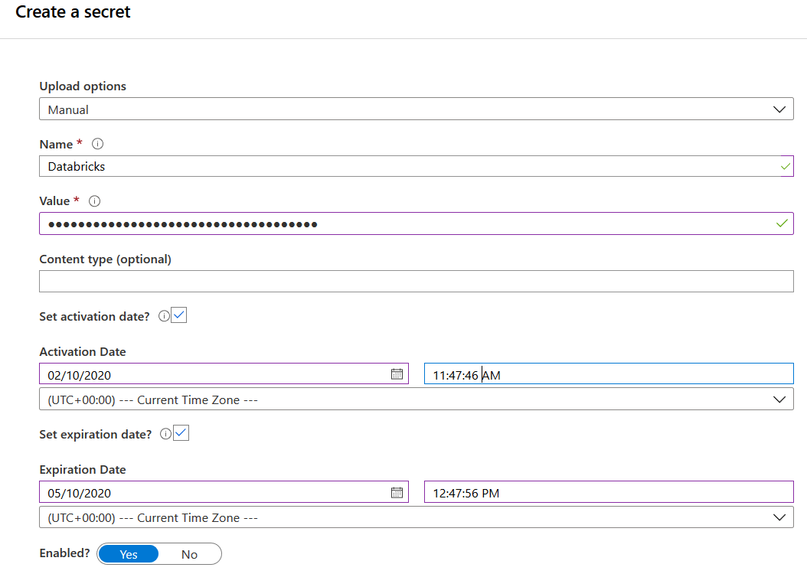
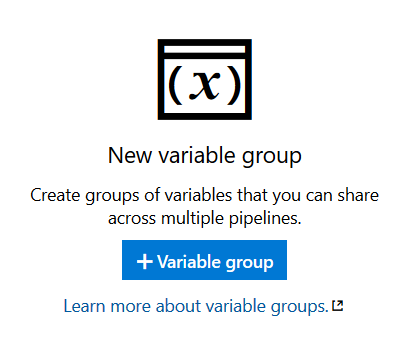
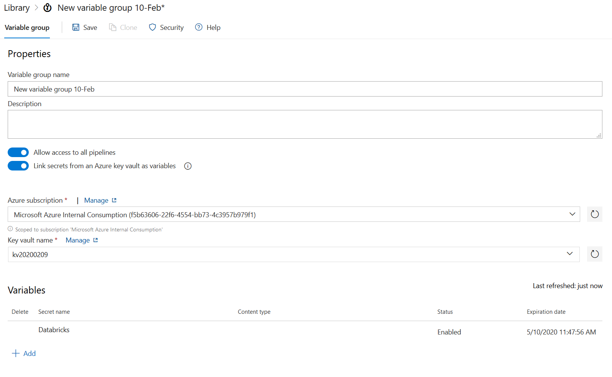

# Data Platform DevOps - Azure Databricks
**Produced by Dave Lusty**

## Introduction
This demo shows how to use DevOps pipelines and branching for code promotion within Azure DevOps. The video is available [coming soon](youtu.be/CW5GXIEhePE )

<a href="https://portal.azure.com/#create/Microsoft.Template/uri/https%3A%2F%2Fraw.githubusercontent.com%2Fdavedoesdemos%2FDataDevOps%2Fmaster%2FDatabricks%2Fdeploy%2Fazuredeploy.json" target="_blank">
    
    </a>
This button doesn't yet work!

## Setup

### Azure Key Vault

Log into your Azure Portal and click add resource. Choose Azure Key Vault then click Create.


Set up a resource group for the demo and give your keyvault a unique name


Leave the remaining options as default and click Create.

### Azure Databricks

In the portal, add an Azure Databricks resource.


Give your workspace a name and select the demo resource group. Leave all other settings as default and click Create.



## Key Vault



Give the token a name and select a suitable lifespan. Note that it should become a normal part of your administration to rotate these tokens. It is entirely possible to automate that process through the Token API in Databricks and the command line access of Key Vault but I won't go into that here.



Copy the generated token now as you won't be able to access it again.


Open your Key Vault and click Secrets on the menu, then Generate/Import.



Enter your secret and give the secret a descriptive name. Add in the expiration timestamp to ensure you have this recorded centrally.



## Azure DevOps

In your DevOps project, click Pipelines and then Library. Next, click + Variable Group.



Give the group a name such as Azure Key Vault. Select to link secrets from an Azure Key Vault and then select your subscription and Key Vault from the drop down lists. You may need to click authorize to configure the connections. Add in the Databricks token variable and click save.



```powershell
# Upload a notebook to Azure Databricks
# Docs at https://docs.microsoft.com/en-us/azure/databricks/dev-tools/api/latest/workspace#--import


$fileName = "$(System.DefaultWorkingDirectory)/_build/Notebooks/Users/dalusty@microsoft.com/test.py"
$newNotebookName = "ImportedNotebook"
# Get our secret from the variable
$Secret = "Bearer " + "$(Databricks)"

# Set the URI of the workspace and the API endpoint
$Uri = "https://northeurope.azuredatabricks.net/api/2.0/workspace/import"

# Open and import the notebook
$BinaryContents = [System.IO.File]::ReadAllBytes($fileName)
$EncodedContents = [System.Convert]::ToBase64String($BinaryContents)

$Body = @{
    content = "$EncodedContents"
    language = "PYTHON"
    overwrite = $true
    format = "SOURCE"
    path= "/Users/<your user>/" + "$newNotebookName"
}

#Convert body to JSON
$BodyText = $Body | ConvertTo-Json

$headers = @{
    Authorization = $Secret
}

Invoke-RestMethod -Uri $uri -Method Post -Headers $headers -Body $BodyText
```