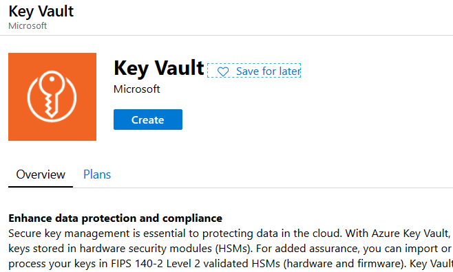
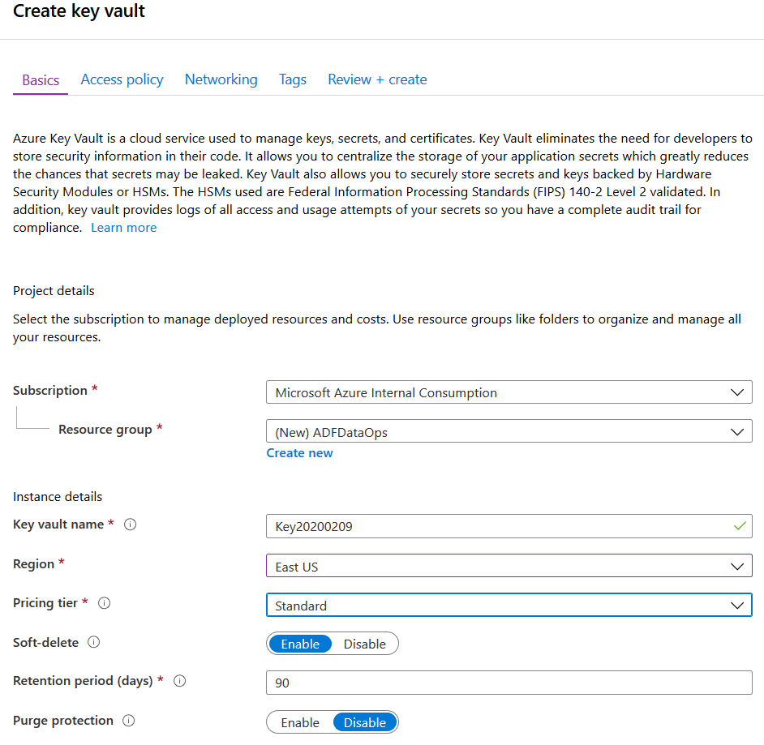
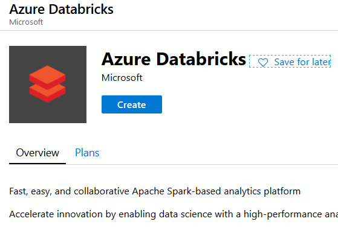
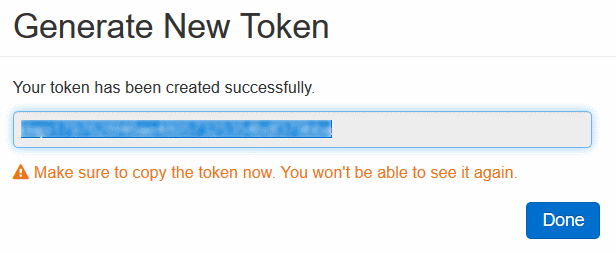

# Data Platform DevOps - Azure Databricks
**Produced by Dave Lusty**

## Introduction
This demo shows how to use DevOps pipelines and branching for code promotion within Azure DevOps. The video is available [coming soon](youtu.be/CW5GXIEhePE )

This button doesn't yet work!

## Setup

### Azure Key Vault

Log into your Azure Portal and click add resource. Choose Azure Key Vault then click Create.

Set up a resource group for the demo and give your keyvault a unique name

Leave the remaining options as default and click Create.

### Azure Databricks

In the portal, add an Azure Databricks resource.

Give your workspace a name and select the demo resource group. Leave all other settings as default and click Create.

## Key Vault

Give the token a name and select a suitable lifespan. Note that it should become a normal part of your administration to rotate these tokens. It is entirely possible to automate that process through the Token API in Databricks and the command line access of Key Vault but I won't go into that here.

Copy the generated token now as you won't be able to access it again.

